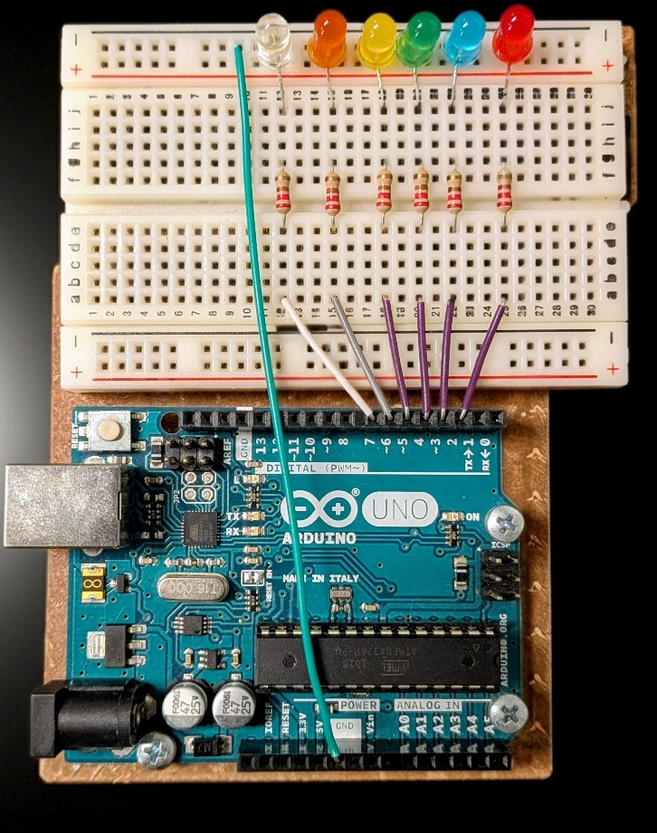
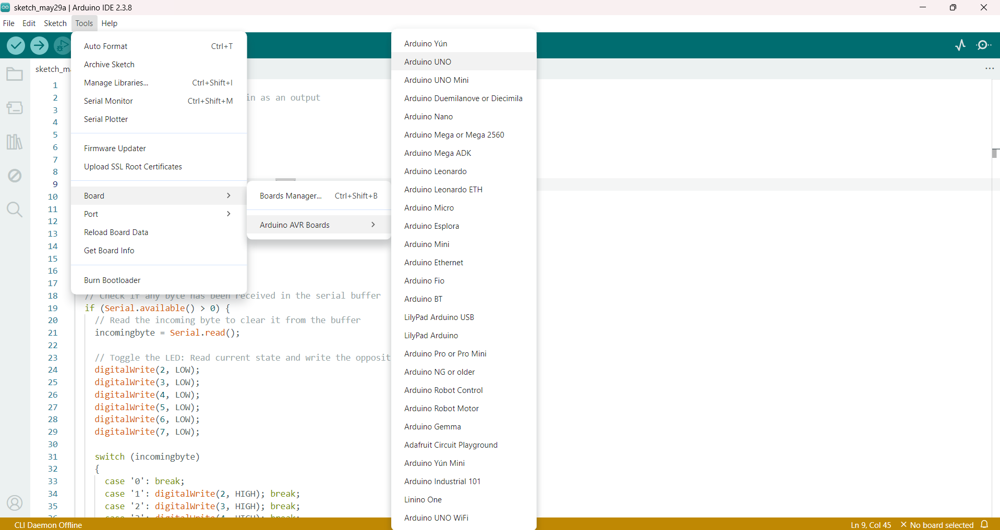
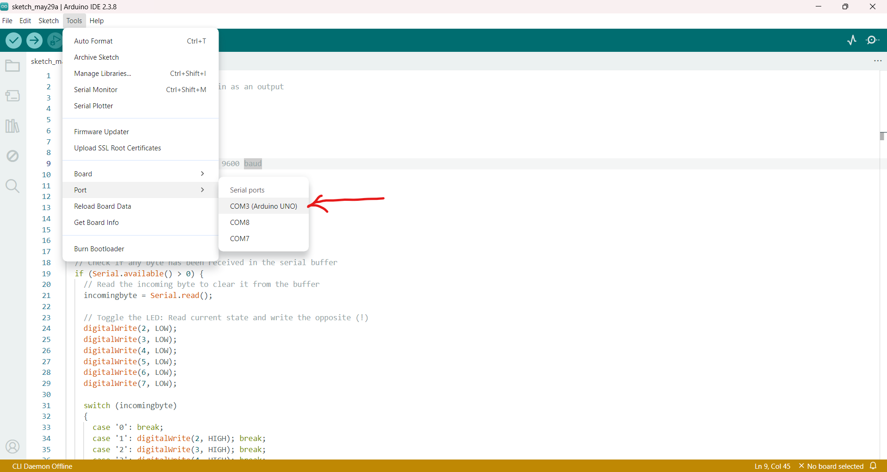
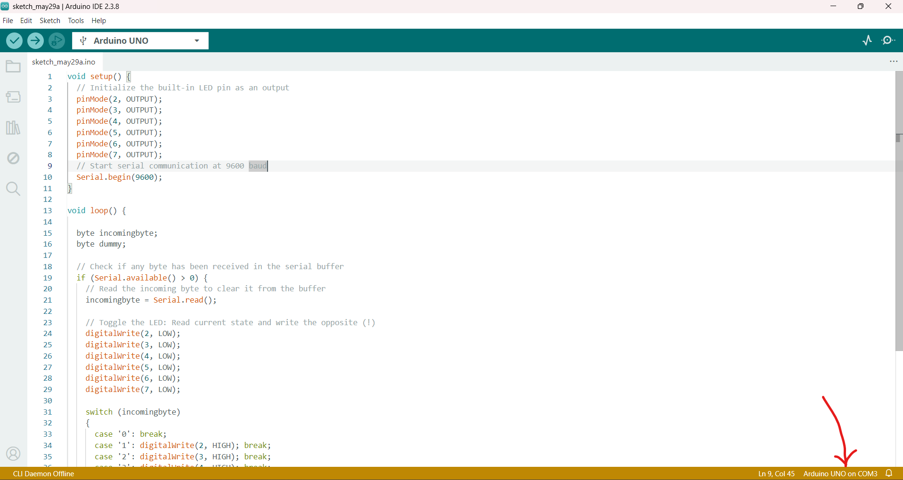
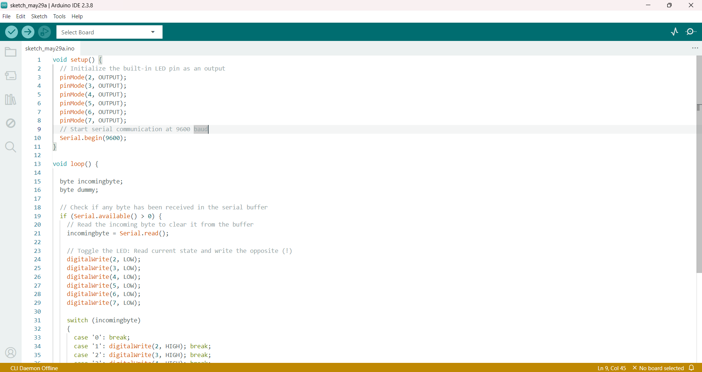
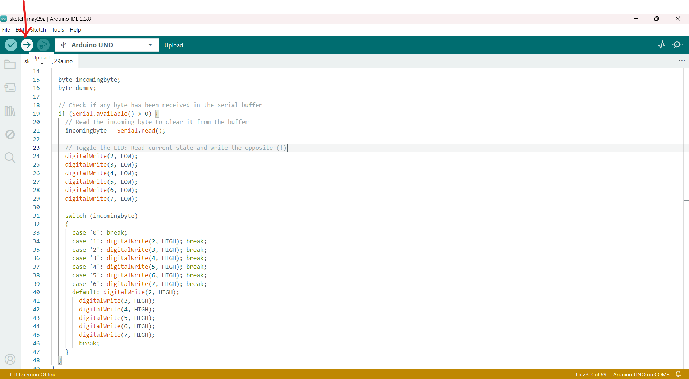
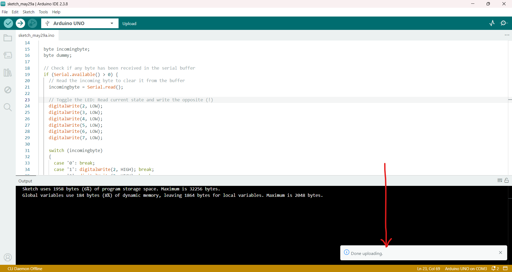

# Mood Mirror — Emotion Detection with Arduino LEDs

Detect facial emotions from your laptop webcam using [DeepFace](https://github.com/serengil/deepface), then light up a coloured LED on an Arduino breadboard that matches how you feel.

This guide follows the steps in **Steps to implement this project.docx**. The main Python script in that document is called `main.py`; in this repository the same program is **`final.py`**.

---

## What this project does

1. Opens your computer’s webcam and takes a photo.
2. Sends the photo to DeepFace to find the dominant emotion.
3. Sends a serial command to Arduino (`'1'`–`'6'`).
4. Turns on the matching LED colour for a few seconds, then turns all LEDs off.

| Emotion  | Serial command | Arduino pin | LED colour |
|----------|----------------|-------------|------------|
| Happy    | `'1'`          | D2          | Green      |
| Sad      | `'2'`          | D3          | Blue       |
| Angry    | `'3'`          | D4          | Red        |
| Surprise | `'4'`          | D5          | Yellow     |
| Fear     | `'5'`          | D6          | Orange     |
| Neutral  | `'6'`          | D7          | White      |
| All off  | `'0'`          | —           | —          |

---

## What you need

- Arduino UNO (or compatible board)
- USB cable
- Breadboard, jumper wires, resistors (one per LED)
- 6 LEDs: green, blue, red, yellow, orange, white
- Windows laptop with a webcam
- [Arduino IDE](https://www.arduino.cc/en/software)
- Python 3.10+ and a code editor (VS Code, Cursor, etc.)

---

## Part 1 — Build the circuit

Wire the Arduino to the breadboard with six LEDs and resistors, as in your classroom build.



- Connect each LED anode (via a resistor) to digital pins **2, 3, 4, 5, 6, and 7**.
- Connect all LED cathodes to a common **GND** rail on the breadboard.
- Connect breadboard GND to Arduino **GND**.
- Power the Arduino from USB.

---

## Part 2 — Arduino setup

### Step 1 — Install Arduino IDE

Download and install the Arduino IDE on your computer. This is where you upload code to the microcontroller.

### Step 2 — Plug in the Arduino

Connect the Arduino to your laptop with the USB cable.

### Step 3 — Select the board

In the IDE menu: **Tools → Board → Arduino AVR Boards → Arduino UNO**.



### Step 4 — Select the serial port

Go to **Tools → Port** and choose the port where your Arduino appears (often **COM3** on Windows).



After selection, the status bar should show something like **Arduino UNO on COM3**:



> **Note:** If your port is different (e.g. COM4), remember it — you will use the same port in `final.py` (`PORT = "COM3"`).

### Step 5 — Copy the Arduino sketch

Open `arduino/emotion_leds.ino` in the Arduino IDE (or copy the code below into a new sketch):

```cpp
void setup() {
  pinMode(2, OUTPUT);
  pinMode(3, OUTPUT);
  pinMode(4, OUTPUT);
  pinMode(5, OUTPUT);
  pinMode(6, OUTPUT);
  pinMode(7, OUTPUT);
  Serial.begin(9600);
}

void loop() {
  byte incomingbyte;

  if (Serial.available() > 0) {
    incomingbyte = Serial.read();

    digitalWrite(2, LOW);
    digitalWrite(3, LOW);
    digitalWrite(4, LOW);
    digitalWrite(5, LOW);
    digitalWrite(6, LOW);
    digitalWrite(7, LOW);

    switch (incomingbyte) {
      case '0': break;
      case '1': digitalWrite(2, HIGH); break;
      case '2': digitalWrite(3, HIGH); break;
      case '3': digitalWrite(4, HIGH); break;
      case '4': digitalWrite(5, HIGH); break;
      case '5': digitalWrite(6, HIGH); break;
      case '6': digitalWrite(7, HIGH); break;
      default:
        digitalWrite(2, HIGH);
        digitalWrite(3, HIGH);
        digitalWrite(4, HIGH);
        digitalWrite(5, HIGH);
        digitalWrite(6, HIGH);
        digitalWrite(7, HIGH);
        break;
    }
  }
}
```

Your sketch in the IDE should look like this:



### Step 6 — Upload to the Arduino

Click the **Upload** button (arrow icon) in the toolbar.



When upload finishes, you should see **Done uploading**:



---

## Part 3 — Python setup and run (`final.py` / `main.py`)

### Step 1 — Install Python

Install Python 3 from [python.org](https://www.python.org/downloads/). During setup, tick **“Add Python to PATH”**.

### Step 2 — Install Python libraries

Open a terminal in this project folder and run:

```powershell
cd "C:\Projects\Deepface image emotion analysis\emotionDetectionLedNew"
pip install -r requirements.txt
```

The first time you use DeepFace, it may download models (this can take several minutes).

### Step 3 — Create your Python file

In the Word document this file is named **`main.py`**. In this project the same code lives in **`final.py`**.

You can either:

- Run **`final.py`** directly, or  
- Copy `final.py` to `main.py` if you want the exact filename from the document.

### Step 4 — Configure settings

Edit the top of `final.py` if needed:

| Setting          | Default | What to change                          |
|------------------|---------|-----------------------------------------|
| `CAMERA_INDEX`   | `0`     | Use `1` if the wrong webcam opens       |
| `PORT`           | `"COM3"`| Match **Tools → Port** in Arduino IDE   |
| `BAUD`           | `9600`  | Must match `Serial.begin(9600)` in sketch |

### Step 5 — Run the program

1. Close the **Arduino IDE Serial Monitor** (only one program can use the COM port at a time).
2. In a terminal:

```powershell
python final.py
```

### What happens when you run it

1. **Camera** — Opens the webcam, waits 2 seconds for warmup, captures one frame, saves `instant_photo.jpg`.
2. **DeepFace** — Analyses the face for emotion and prints the dominant mood and scores.
3. **Arduino** — Opens the serial port, sends the LED command for that emotion, waits 5 seconds, then sends `'0'` to turn all LEDs off.

Example output:

```text
Snapshot saved: instant_photo.jpg
Dominant emotion: happy
Scores (% confidence):
  happy: 99.99
  neutral: 0.01
  ...
```

---

## Python code overview (`final.py`)

The script uses four main libraries:

| Library    | Role                                      |
|------------|-------------------------------------------|
| `deepface` | Emotion detection on the webcam photo     |
| `cv2`      | Open webcam and save the snapshot         |
| `serial`   | Send commands to Arduino over USB         |
| `time`     | Warmup delays and LED timing              |

Core flow in `final.py`:

```python
# 1. Capture from webcam
cap = cv2.VideoCapture(CAMERA_INDEX)
# ... read frame, save instant_photo.jpg

# 2. Analyse emotion
demography = DeepFace.analyze(frame, ["emotion"], silent=True, detector_backend="opencv")
dominant = demography[0].get("dominant_emotion")

# 3. Control LEDs via serial
if dominant == "happy":
    ser.write(b"1")
elif dominant == "sad":
    ser.write(b"2")
# ... angry, surprise, fear, neutral ...
ser.write(b"0")  # all off
```

---

## Optional — Web page version (`app.py`)

This repo also includes a **Mood Mirror** web UI for demos (e.g. Year 8 classroom):

```powershell
python app.py
```

Then open **http://127.0.0.1:5000** in a browser and click **Take Photo!**

- DeepFace loads **once** when the server starts (faster repeat photos).
- Same emotion → LED mapping as `final.py`.
- Keep the terminal running while you use the page.

Files:

| File                 | Purpose                          |
|----------------------|----------------------------------|
| `final.py`           | Standalone script (`main.py` in doc) |
| `app.py`             | Flask backend + camera + serial  |
| `static/index.html`  | Student-friendly web interface   |
| `arduino/emotion_leds.ino` | Arduino firmware           |

---

## Troubleshooting

| Problem | What to try |
|---------|-------------|
| `Could not open camera` | Change `CAMERA_INDEX` to `1`; close other apps using the webcam |
| Serial / COM port error | Check USB cable; set `PORT` to match Arduino IDE; close Serial Monitor |
| Wrong LED lights up | Re-check breadboard wires vs pins 2–7; re-upload Arduino sketch |
| DeepFace slow first run | Normal — models download once; later runs are faster |
| `python app.py` won’t stop | Press **Ctrl+C** twice, or **Ctrl+Break** on Windows |
| Web page can’t reach server | Run `python app.py` first, then open http://127.0.0.1:5000 |

---

## Project structure

```text
emotionDetectionLedNew/
├── README.md
├── final.py                 # Main Python script (main.py in Word doc)
├── app.py                   # Optional web server
├── requirements.txt
├── instant_photo.jpg        # Last webcam snapshot (created on run)
├── arduino/
│   └── emotion_leds.ino     # Sketch for Arduino IDE
├── static/
│   └── index.html           # Web UI
└── docs/
    └── images/              # Screenshots from setup guide
```

---

## Credits

- Emotion detection: [DeepFace](https://github.com/serengil/deepface)  
- Hardware: Arduino UNO + breadboard LED circuit  
- Setup guide: *Steps to implement this project.docx*
